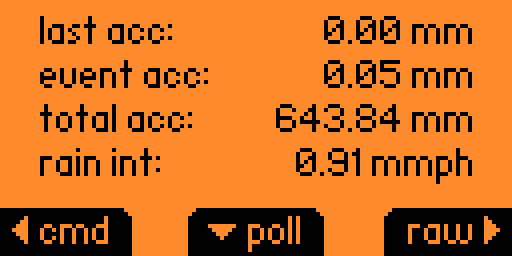
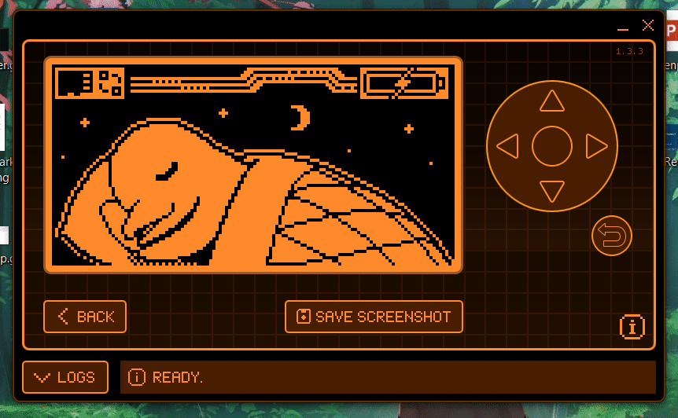
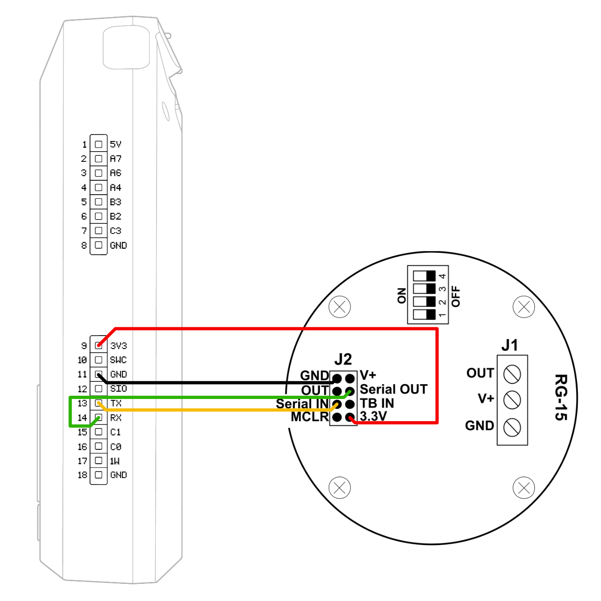
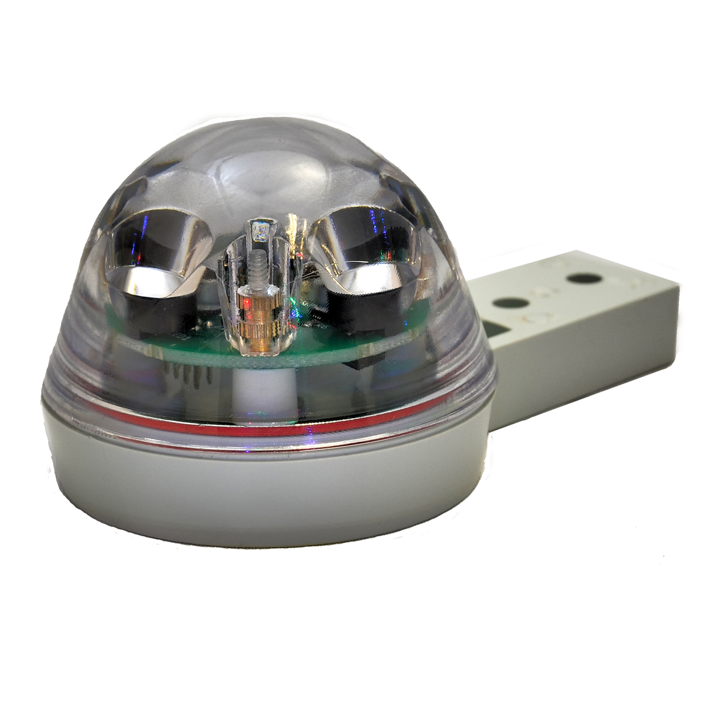

<h1 align="center">rg-15-flipper</h1>
<p align="center">
  <b>
    <a href="https://developer.flipper.net/flipperzero/doxygen/apps_on_sd_card.html">Flipper Zero app (FAP)</a>
    for the
    <a href="https://store.hydreon.com/RG-15.html">RG-15 rain gauge</a>.
  </b>
</p>

<br>

<p align="center">
  <a href="">
      
  </a>
  <a href="https://github.com/flipperdevices/flipperzero-firmware/tree/1.0.1">
    
  </a>
  <a href="https://github.com/cptpiepmatz/rg-15-flipper/blob/main/LICENSE">
      
  </a>
</p>

## About

`rg-15-flipper` is a custom
[FAP](https://developer.flipper.net/flipperzero/doxygen/apps_on_sd_card.html)
for interacting with the
[RG-15 rain gauge](https://store.hydreon.com/RG-15.html) by
[Hydreon](https://store.hydreon.com).
Built in [Rust](https://www.rust-lang.org), it uses the 
[flipperzero-rs/flipperzero](https://github.com/flipperzero-rs/flipperzero)
Rust bindings.
Many thanks for that 🦀❤️🐬.

The app reads sensor data via TTL serial (though the manual refers to it as 
RS-232 at 3.3V) and sends commands to control the sensor's behavior.

<p align="center">
  
</p>

<p align="center">
  
</p>

For further instructions, check the 
[manual](./docs/2022.07.18-rev-1.000-rg-15_instructions.pdf) in the `docs`
directory.

## Installation

1. Install the [Rust toolchain](https://www.rust-lang.org/tools/install).

2. Add the `thumbv7em-none-eabihf` target:
    ```sh
    rustup target add thumbv7em-none-eabihf
    ```

3. Build the FAP:
    ```sh
    cargo build --release
    ```

The built binary will be located at
`./target/thumbv7em-none-eabihf/release/rg-15-flipper.fap`.
Use the [qFlipper](https://flipperzero.one/update) app to copy it to your 
Flipper's SD card.

Connect the sensor to the Flipper, ensuring GND is connected first.



## The RG-15



For FAQs, refer to 
[Hydreon's FAQ page](https://rainsensors.com/support/rg-9-rg-15-faq/).

An interesting feature of the RG-15 is it's non-volatile memory, which stores
settings like:

- Baud rate
- Precision
- Continous vs polling mode
- Metric vs imperial units
- Total rain accumulation

These settings persist after reboot.
The J2 port has a memory clear (MCLR) pin, though I don't know whether you need 
to pull it high or low to clear the memory.

## License

Licensed under the MIT License. 
See [LICENSE](./LICENSE) for details.

## Forking

This FAP was primarily developed to test the sensor and as a learning exercise. 
I don’t plan to continue development, so feel free to fork the repo and make 
changes as needed.
